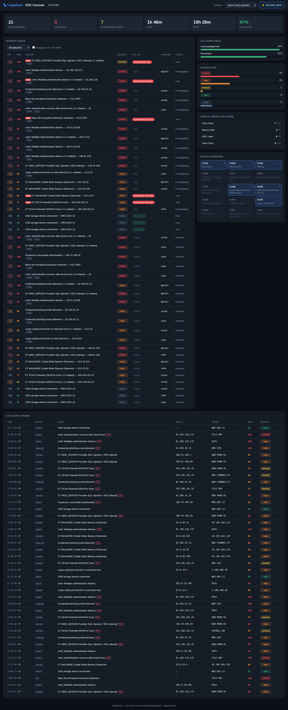
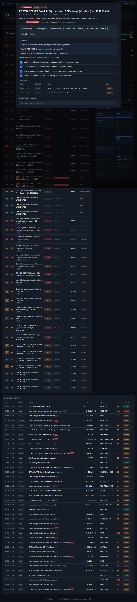

# TriageDesk — SOC Alert Triage & Incident Management


A lightweight **Security Operations Center (SOC) platform** that turns thousands of raw
security alerts into a handful of **enriched, risk-ranked incidents** an analyst can
actually work — with **SLA tracking**, **MITRE ATT&CK** mapping, and response playbooks.

> Built as my Information Technology capstone. It automates the day-to-day workflow of a
> Tier-1/2 SOC analyst: collect alerts → add context → score → group → track → respond.



---

## The problem it solves

A company runs many security tools, and together they fire **thousands of alerts a day** in
different formats. Analysts can't review them all, so real threats get buried in the noise,
incidents sit unowned past their deadline, and there's no single place to manage them.
TriageDesk is the **control room**: one screen, one queue, one workflow.

## How it works — one alert's journey

```
 Wazuh / Suricata / Firewall / API
              │
              ▼
   INGEST  →  ENRICH  →  SCORE  →  CORRELATE  →  SLA  →  ANALYST WORKFLOW  →  Dashboard
 normalize   threat-    risk      group into    dead-   acknowledge / assign /
 to one      intel +    0–100     incidents     lines   resolve + verdict + audit
 schema      asset ctx                          + auto-escalation
```

Every alert is normalized, enriched, scored, correlated and put on an SLA clock
**automatically** — so by the time an analyst looks, triage is mostly done.

## Screenshots

**Analyst console** — risk-ranked queue, live SLA timers, team metrics, ATT&CK coverage (above).

**Working an incident** — enrichment, ATT&CK playbook, one-click actions, audit trail:



## Key features

- **Multi-source ingestion** — parsers for Wazuh JSON, Suricata EVE, generic/CSV, and a REST
  API, all normalized to one alert schema (adding a tool = one small parser).
- **Enrichment** — matches source IPs against a threat-intel feed, adds business-asset
  context (is the target a crown-jewel system?), flags internal sources. Works **fully
  offline**, no API keys; live feeds are pluggable.
- **Risk scoring** — fuses severity, threat-intel confidence and asset criticality into one
  0–100 score, so a *medium* alert on the payroll DB outranks a *high* on a test box.
- **Correlation** — groups related alerts from the same actor into a single incident.
- **SLA engine** — per-severity acknowledge/resolve deadlines, live on-track / at-risk /
  breached status, and **automatic escalation** of overdue incidents. Produces **MTTA, MTTR
  and SLA-compliance** metrics.
- **Analyst workflow** — acknowledge, assign, investigate, resolve with a verdict
  (true/false positive/benign), case notes, and a full **audit trail**.
- **MITRE ATT&CK** — every incident carries techniques and a step-by-step response playbook.

## Results (deterministic demo dataset)

| Metric | Value |
|---|---|
| Alerts ingested / normalized | **66** across 4 source formats |
| Incidents after correlation | **42** (noise reduced ~36%) |
| Acknowledged within SLA | **97%** |
| Auto-escalated incidents | **5** |
| Automated tests | **24 passing** |
| Paid services / setup required | **0** |

## Run it locally

**Windows:** double-click **`run.bat`** (uses Python 3.12, installs deps on first run).

**Any OS:**
```bash
pip install -r requirements.txt
python -m uvicorn web.app:app --port 8000
```
Then open **http://127.0.0.1:8000**. Run the tests with `python -m pytest tests/ -q`.

## Tech stack

**Python · FastAPI · SQLite · vanilla-JS single-file dashboard · pytest.**
~1,450 lines of application code, no heavyweight framework, runs on a laptop.

## Repository layout

```
config/      SLA policy + asset inventory
src/common/  models, SQLite, ATT&CK reference, helpers
src/ingest/  multi-source normalizer + synthetic alert generator
src/enrich/  enrichment engine + bundled threat-intel feed
src/triage/  risk scoring, correlation, SLA engine, workflow
src/engine.py  pipeline orchestrator
web/         FastAPI backend + dashboard.html
tests/       24 unit + integration tests
docs/        project report, screenshots
```

## Project documents

- **Full project report:** [`docs/TriageDesk_Project_Report.docx`](docs/TriageDesk_Project_Report.docx)
- **Presentation:** [`TriageDesk_Presentation.pptx`](TriageDesk_Presentation.pptx)

## Scope & honesty

The bundled threat feed and asset inventory are illustrative samples (not live feeds), and an
"acting analyst" selector stands in for real authentication — both are designed to be swapped
for production equivalents. Full limitations and a Version-2 roadmap are in the report.

## About

Built by **Win Myat Aung (Zane)** — final-year IT student at Siam University, Bangkok,
training for a **SOC analyst / blue-team** role (hands-on with Wazuh and ManageEngine Log360,
studying CompTIA CySA+).
[Portfolio](https://winmyataun0007-hue.github.io/Win-Myat-Aung-Work-profile/) ·
[LinkedIn](https://www.linkedin.com/in/win-myat-aung-46630a35b/)

## License

MIT — see [LICENSE](LICENSE).
